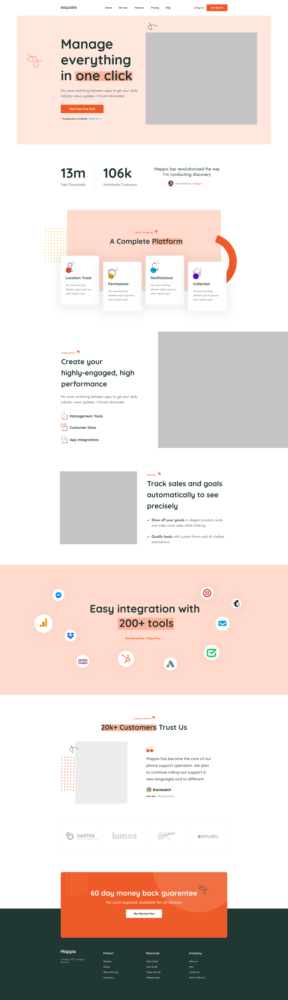

## Todos

- [ x ] Complete this README 
- [ x ] Add Sanity to this project
- [ ] Update Mobile views (currently not responsive)
- [ ] Build out sections of the UI (and be editable in Sanity)
    - [ x ] Hero
    - [ x ] Stats and Testimonials 
    - [ x ] Cards
    - [ ] Alternating Image X Content sections
    - [ ] Integrations 
    - [ ] Standalone Testimonials
    - [ ] Customer Logos
    - [ ] Bottom Cta 
    - [ ] Footer
- [ ] Build out a Blog
- [ ] Create pages
    - [ ] About us 
    - [ ] Pricing
    - [ ] Contact us
- [ ] Add schemas for (in Sanity)
    - [ ] Main Nav
    - [ ] Footer Nav
    - [ ] Articles 
    - [ ] Categories
    - [ ] Authors
    - [ ] Team members
- [ ] Make the page loading time relistic
    - [ ] Adding cookie banner (https://mxd.codes/articles/how-to-create-a-cookie-banner-for-your-react-application)
    - [ ] Fake Google Tag Manager
    - [ ] Fake FB pixel
    - [ ] Fake GA4
    - [ ] Chatbot
- [ ] Can this be more accesabile (Reduce motion, audit HTML, screen reader etc.)
- [ ] !!Fix TS types for RenderSections and temp any fix in index. 

Working towards something like this:
